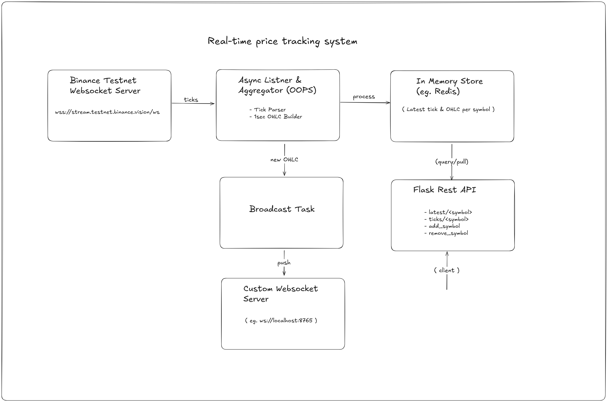

# Crypto Price Streaming Platform

A real-time cryptocurrency price streaming platform built with **FastAPI**, **Binance Testnet**, and **WebSockets**.  
It provides both **REST APIs** and **real-time streaming** for 1s OHLC (Open-High-Low-Close) and tick-level price updates.

---

## Table of Contents

- [Overview](#overview)
- [Features](#features)
- [Architecture](#architecture)
- [Quick Start](#quick-start)
- [API Documentation](#api-documentation)
- [WebSocket Streaming](#websocket-streaming)
- [Project Structure](#project-structure)
- [Tech Stack](#tech-stack)
- [Future Improvements](#future-improvements)

---

## Overview

A production-ready real-time cryptocurrency price streaming system built with **FastAPI** that:

- Connects to **Binance Testnet** for live market data  
- Aggregates tick data into **1-second OHLC candles**  
- Provides **REST API** for on-demand queries (**Pull model**)  
- Broadcasts real-time updates via **WebSocket** (**Push model**)  
- Supports **dynamic symbol management** (add/remove on the fly)  
- Features comprehensive **error handling and logging**
- Implements **parallel WebSocket connections per symbol**
- Uses **WebSocket compression** for optimized performance
- Supports **asynchronous broadcasting** for concurrent client updates
- Applies **rate limiting per IP address** (via SlowAPI)
- Handles **auto-reconnection, symbol validation**

This architecture enables you to build real-time trading dashboards, automated bots, or analytics systems on top of a stable and scalable backend.

---

## Core Functionality

| Feature | Description |
| :--- | :--- |
| **Live Price Streaming** | Real-time tick data from Binance Testnet. |
| **1-Second OHLC** | Precise candle generation aligned to clock seconds. |
| **Parallel Binance Streams** | Each trading symbol runs on its own async WebSocket connection. |
| **REST API** | FastAPI endpoints for querying market data. |
| **WebSocket Push** | Live candle broadcasts to connected clients. |
| **Symbol Management** | Add/remove trading pairs dynamically via API. |
| **Auto-Reconnection** | Resilient connection with exponential backoff. |
| **Symbol Validation** | Validates against live Binance Testnet symbols. |
| **Rate Limiting (IP-based)** | Per-client request limits with SlowAPI. |
| **Async Broadcasting** | Concurrent message delivery to all clients. |
| **WebSocket Compression** | Uses deflate for efficient streaming. |


---

## Architecture



---
## Quick Start

Before you begin, make sure you have the following installed:

- **Python 3.8 or higher**
- **Internet connection** (required to connect to Binance Testnet)

```bash
# 1. Clone the repository
git clone https://github.com/AshokAdithya/PinsecProject/
cd PinsecProject

# 2. Create virtual environment - On Windows
python -m venv .venv
source .venv/Scripts/Activate  

# 3. Install dependencies
pip install -r requirements.txt

# 4. Configure environment variables
create a file .env

# Copy the contents below and paste it in your .env

# API
BINANCE_LIST=https://testnet.binance.vision/api/v3/exchangeInfo
BINANCE_TESTNET=wss://stream.binance.com:9443/stream

# WEBSOCKET
WEBSOCKET_IP=0.0.0.0
WEBSOCKET_PORT=8765

# SERVER 
SERVER_IP=0.0.0.0
SERVER_PORT=8000

# Start the service
python -m app.main

# Start the websocket client
# Add symbols using Rest API with the follwing documentation given below

cd websocket_client
python ws_client.py

```

## API Documentation

### 1. Health Check  
**GET** `/`

**Response:**
```json
{
  "message": "Crypto Price Streaming Platform is active"
}
```

### 2. List Available Symbols
**GET** `/symbols/available`

**Response:**
```json
{
  "count": 200,
  "symbols": ["BTCUSDT", "ETHUSDT", "BNBUSDT", ...]
}
```

### 3. List Active Symbols
**GET** `/symbols`

**Response:**
```json
{
  "symbols": ["BTCUSDT", "ETHUSDT"]
}
```

### 4. Add Symbol
**POST** `/add_symbol`

**Request Body:**
```json
{
  "symbol": "BTCUSDT"
}
```

**Response:**
```json
{
  "message": "Subscribed to BTCUSDT",
  "symbol": "BTCUSDT"
}
```

### 5. Remove Symbol
**DELETE** `/remove_symbol/{symbol}`

**Response:**
```json
{
  "message": "Unsubscribed from BTCUSDT"
}
```

### 6. Get Latest Tick
**GET** `/tick/{symbol}`

**Response:**
```json
{
  "symbol": "BTCUSDT",
  "price": 53250.50,
  "qty": 0.05234,
  "timestamp": "2024-11-10 15:30:45 IST"
}
```


### 7. Get Latest OHLC Candle
**GET** `/ohlc/{symbol}`

**Response:**
```json
{
  "symbol": "BTCUSDT",
  "timestamp": "2024-11-10 15:30:45 IST",
  "open": 53250.50,
  "high": 53275.00,
  "low": 53240.20,
  "close": 53260.75
}
```

---

## WebSocket Streaming

Run the Client

To start the WebSocket client and stream real-time OHLC updates, run:

```bash
python websocket_client/ws_client.py

```

Message Format

Every second, you'll receive a JSON message like this:

```json
{
  "symbol": "BTCUSDT",
  "timestamp": "2024-11-10 15:30:45 IST",
  "open": 43250.50,
  "high": 43275.00,
  "low": 43240.20,
  "close": 43260.75
}
```
---

## Project Structure

```bash
crypto-price-streaming-platform/
│
├── app/
│   ├── __init__.py
│   ├── main.py                      # Application entry point
│   │
│   ├── api/
│   │   ├── __init__.py
│   │   └── routes.py                # REST API endpoints
│   │
│   ├── binance/
│   │   ├── __init__.py
│   │   └── client.py                # Binance WebSocket client
│   │
│   ├── config/
│   │   ├── __init__.py
│   │   └── binance_symbols.py       # Symbol validation & fetching
│   │
│   ├── core/
│   │   ├── __init__.py
│   │   ├── models.py                # Data models (Tick, Candle)
│   │   ├── aggregator.py            # 1-second OHLC aggregation
│   │   └── broadcaster.py           # WebSocket broadcasting
│   │
│   ├── manager/
│   │   ├── __init__.py
│   │   └── symbol_manager.py        # Symbol lifecycle management
│   │
│   ├── utils/
│   │   ├── __init__.py
│   │   ├── logger.py                # Logging configuration
│   │   ├── time_format.py           # Timestamp formatting (IST)
|   |   └── limiter.py               # Global rate limiter
│   │
│   └── websocket/
│       ├── __init__.py
│       └── server.py                # WebSocket server
│
├── websocket_client/
│   └── ws_client.py                 # Example WebSocket client
│
├── .env                             # Environment variables
├── .gitignore                       # Git ignore rules
├── requirements.txt                 # Python dependencies
└── README.md             
```

---

##  Tech Stack

* **FastAPI** — High-performance Python web framework
* **Uvicorn** — ASGI server with WebSocket & compression support
* **WebSockets** — Real-time streaming communication
* **Binance Testnet** — Live market data source
* **SlowAPI** — IP-based rate limiting
* **Asyncio** — Concurrency and background tasks
* **Python-Dotenv** — Environment variable management

---

## Future Improvements

This platform is already production-grade, but the following improvements can make it enterprise-ready and more feature-rich.

### Database Integration
* Store historical tick and **OHLC** data using **PostgreSQL** or **TimescaleDB**.
* Enables historical analytics, advanced charting, and backtesting capabilities.

### Redis for Scalability
* Use **Redis Pub/Sub** for multi-instance broadcasting and caching.
* Share active symbol states across multiple server instances and improve fault tolerance.

### Reduced Payload & Protobuf
* Replace JSON with **Protocol Buffers (protobuf)** for compact serialization.
* Achieve smaller payloads, faster parsing, and cross-language compatibility.

### Price Alerts & Twilio Integration
* Allow users to set custom alerts for specific price thresholds.
* Notify users instantly via **Twilio SMS** or WhatsApp integration.

### JWT Authentication & Role-Based Access
* Secure both REST and WebSocket endpoints using **JWT tokens**.
* Implement role-based access control (RBAC) to manage permissions.

### Frontend Dashboard
* Build a **React / Next.js** dashboard for real-time visualization.
* Use **Interactive Charts** for interactive OHLC display.

---


